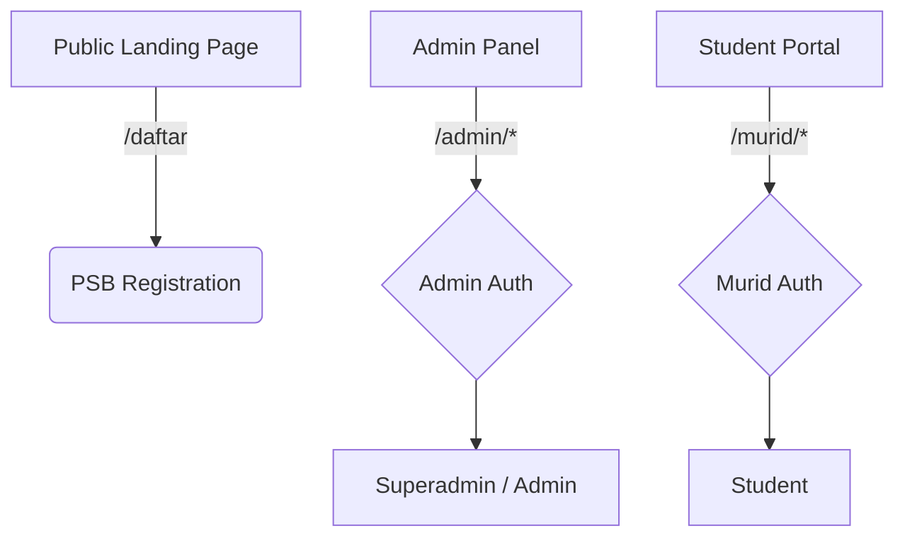

# LMS TPQ — Sistem Manajemen Pembelajaran untuk Taman Pendidikan Al-Qur'an

[](https://php.net)
[](https://laravel.com)
[](https://livewire.laravel.com)
[](https://opensource.org/licenses/MIT)

**LMS TPQ** is a comprehensive Learning Management System built for Taman Pendidikan Al-Qur'an (TPQ) — Islamic Quranic preschools in Indonesia. It combines a public landing page, an admin management panel, and a student portal into a single Progressive Web App.

> **One platform for the whole TPQ ecosystem:** recruit students via the landing page, manage learning operations through the admin panel, and let students access digital content from anywhere — even offline.

---

## Features

### 🏫 Public Landing Page
- Single-page scrollable profile with hero, programs, gallery, testimonials, and contact sections
- Online student registration (PSB) with approval workflow
- SEO-optimized for local discovery
- WhatsApp & phone click-to-contact

### 👨‍💼 Admin Panel (Livewire 4)
- **Student management** — CRUD, level promotion/demotion, password reset
- **Attendance tracking** — daily check-in with monthly recaps
- **4-Domain assessment** — Reading (*baca*), Memorization (*hafalan*), Writing (*tulis*), Practice (*praktik*)
- **Content management** — Doa, Hadist, Stories (*cerita*), Practice guides (*panduan praktik*) with TipTap rich editor
- **Announcements** — broadcast to all students
- **Reports & exports** — PDF (DomPDF) and Excel (Maatwebsite) with filters
- **Landing page CMS** — manage gallery, testimonials, staff profiles, and PSB data

### 🎒 Student Portal (PWA)
- **Quran** reader — per-surah browsing
- **Doa & Hadist** — daily prayers and prophetic traditions
- **Stories & Guides** — illustrated moral stories and step-by-step practice guides
- **Asmaul Husna** — the 99 names of Allah
- **Grades & attendance** — view own scores and attendance history
- **Announcements** — read school-wide announcements
- **Works offline** — fully functional without internet connection

### 🔐 Role-Based Access
| Role | Scope |
|---|---|
| **Superadmin** | System settings, manage admin accounts |
| **Admin (Pengurus)** | All daily operations (students, attendance, assessments, content, reports) |
| **Murid (Student)** | Portal content, own grades & attendance |

---

## Tech Stack

| Layer | Technology |
|---|---|
| **Framework** | Laravel 13.x |
| **Language** | PHP ^8.3 |
| **Admin UI** | Livewire 4 + Alpine.js 3 |
| **Student Portal** | Blade + Alpine.js 3 |
| **Styling** | Tailwind CSS 3 + PostCSS |
| **Rich Editor** | TipTap (stories & guides) |
| **Assets** | Vite 8 |
| **Database** | MySQL / MariaDB / SQLite (testing) |
| **PDF Export** | barryvdh/laravel-dompdf |
| **Excel Export** | maatwebsite/excel ^3.1 |
| **Image Processing** | intervention/image ^4.1 |
| **RBAC** | spatie/laravel-permission |
| **HTML Sanitization** | mews/purifier |
| **PWA** | Custom service worker (no npm package) |

---

## Getting Started

### Prerequisites

- PHP ^8.3 with extensions: `pdo_mysql`, `mbstring`, `xml`, `bcmath`, `gd`, `zip`
- Composer 2.x
- Node.js 18+ (for Vite asset bundling)
- MySQL / MariaDB (or SQLite for development)

### Installation

```bash
# 1. Clone the repository
git clone https://github.com/kevinadisuryanugraha/TPQ-Nurul-Rahmanil-Achyar.git
cd TPQ-Nurul-Rahmanil-Achyar

# 2. Full automated setup
composer run setup
```

The `setup` script handles everything:
```
composer install  →  copy .env  →  key:generate  →  migrate --force  →  npm install  →  npm run build
```

### Development Server

```bash
# Run all services concurrently (PHP server, queue worker, logs, Vite HMR)
composer run dev
```

This starts:
- `php artisan serve` — development HTTP server
- `php artisan queue:listen` — queue worker
- `php artisan pail` — real-time log viewer
- `npm run dev` — Vite hot module replacement

### Testing

```bash
# Run full test suite (clears config first)
composer run test

# Run a single test
php artisan test --filter=SomeTest

# Run specific test suite
php artisan test --testsuite=Feature
php artisan test --testsuite=Unit
```

Tests use SQLite `:memory:` database — no external database required.

### Production Build

```bash
npm run build
php artisan storage:link     # if not already linked
```

---

## Architecture



- **All routes** in a single `routes/web.php` (no API routes, no route file splitting)
- **Two authentication guards**: `admin` (admins table) and `web` (users/students table)
- **Custom middleware**: `superadmin`, `admin`, `murid` — aliased in `bootstrap/app.php`
- **Admin Panel** uses Livewire 4 (no offline support — intended for internal use)
- **Student Portal** is offline-capable via custom service worker at `public/sw.js`

---

## Seeder Data

```bash
php artisan migrate --seed
```

Runs in order: **LevelSeeder → DefaultAdminSeeder → QuranSeeder → DoaSeeder → HadistSeeder → LandingPageSeeder → AsmaulHusnaSeeder**

---

## Project Status

This is an active project in development. The PRD documents (`PRD_LMS_TPQ.md`, `PRD_LandingPage_TPQ.md`) serve as design references — actual implementation may differ.

---

## License

[MIT](https://opensource.org/licenses/MIT) — open source and free for any TPQ to use and adapt.
